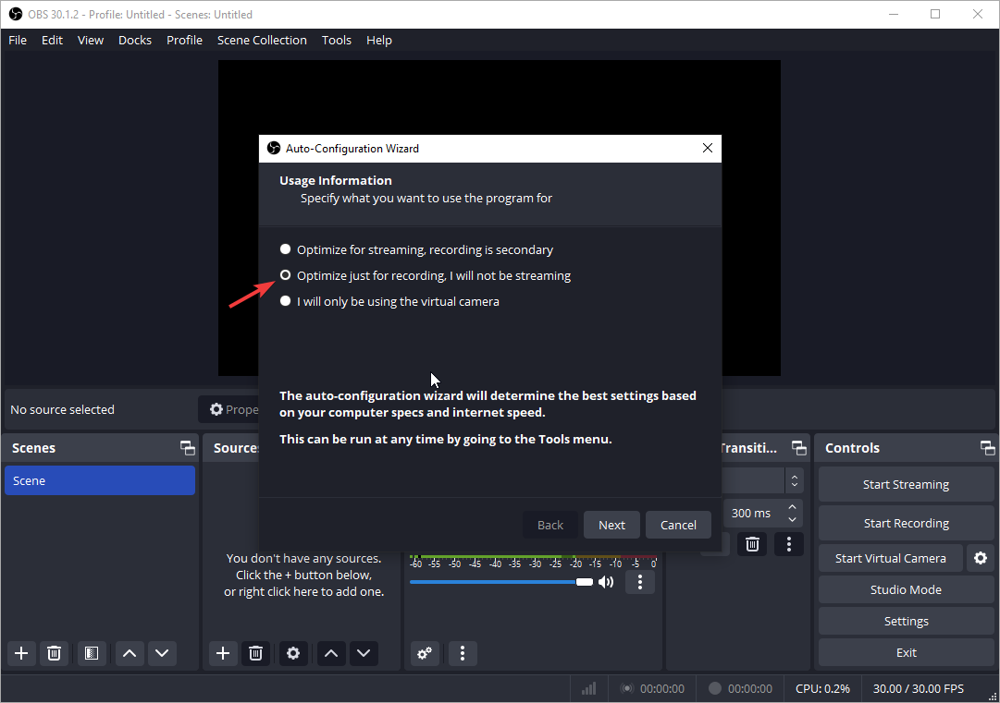
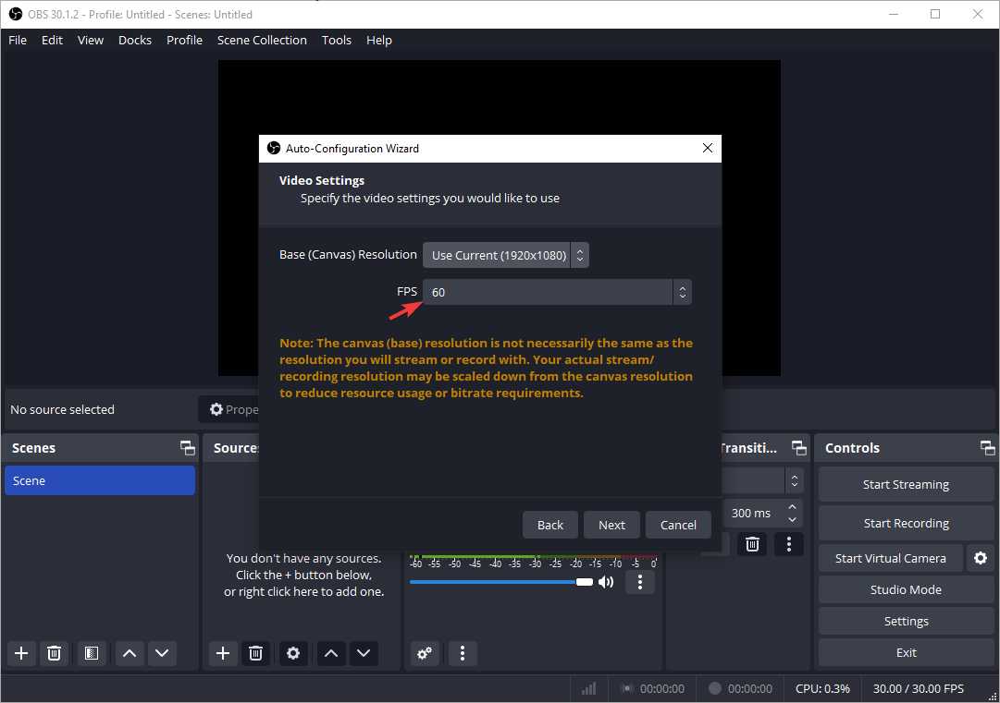
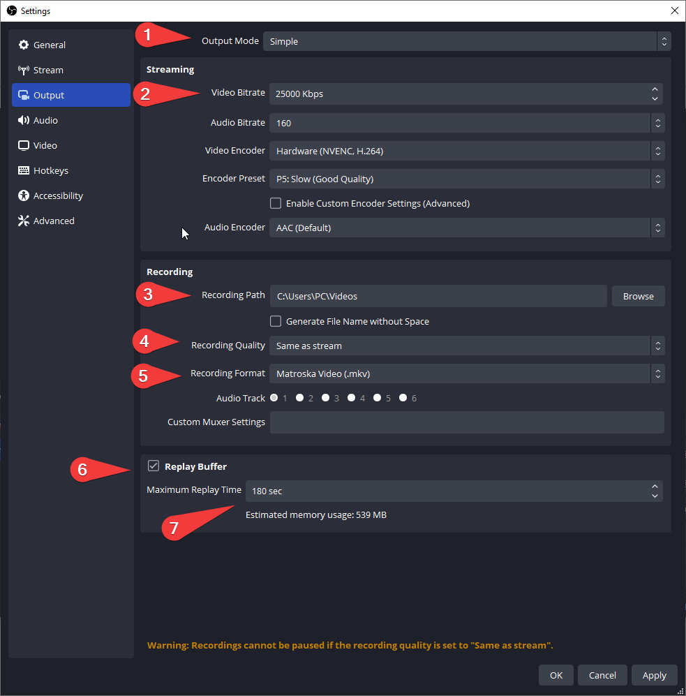
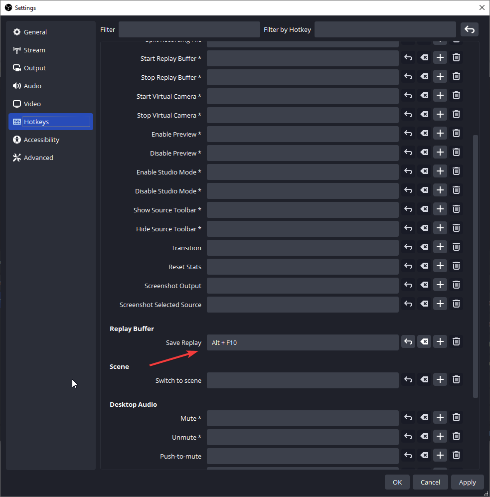
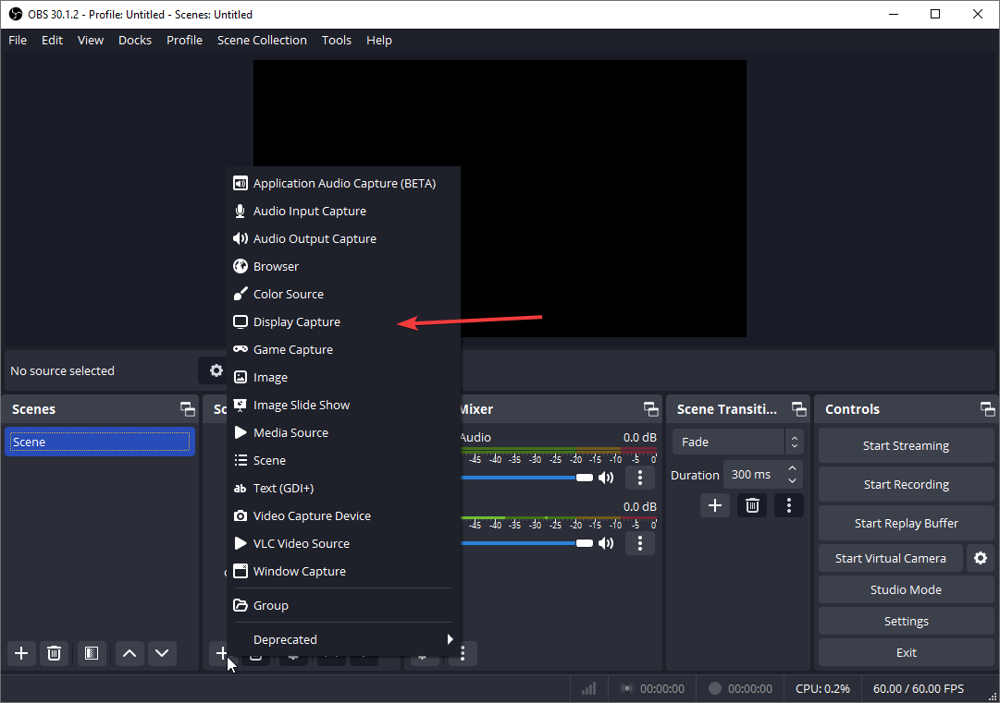
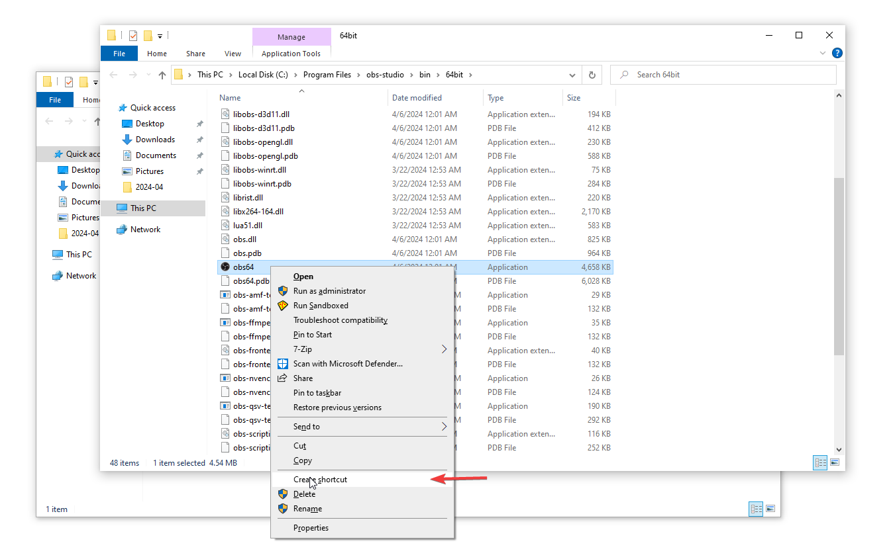
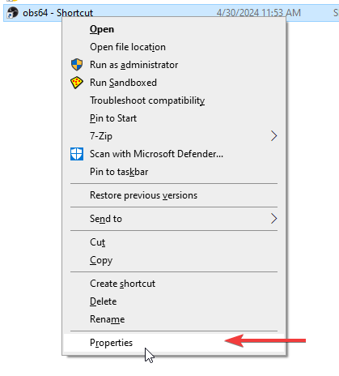
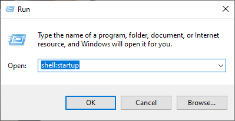
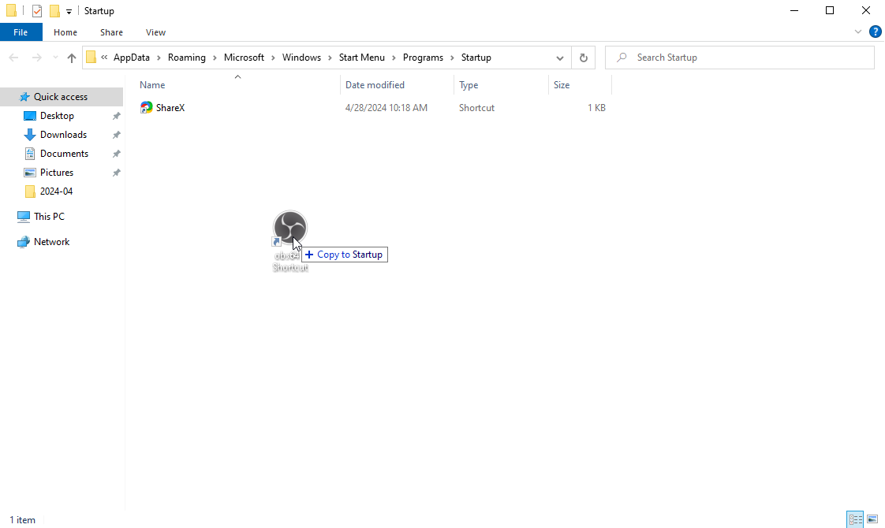

# OBS (Open Broadcaster Software) setup as instant replay replacement guide

1. Download and install OBS : <https://obsproject.com/download>
2. Setup first launch : Choose Optimize just for recording

   
3. Choose your preference for fps 

   
   1. Review and apply settings

      

# Replay Buffer setup

1. Open Output settings :

   
   1. Select Output Mode : Simple

      Set Video Bitrate value of your preference 

      ### [Youtube Recommended Bitrate chart](https://support.google.com/youtube/answer/1722171?hl=en#zippy=%2Cbitrate)

      | Type       | Video Bitrate, Standard Frame Rate  
      (24, 25, 30)      | Video Bitrate, High Frame Rate  
      (48, 50, 60)      |
      |------------|------------------------------------------------------|--------------------------------------------------|
      | 8K         | 80 - 160 Mbps                                        | 120 to 240 Mbps                                  |
      | 2160p (4K) | 35–45 Mbps                                           | 53–68 Mbps                                       |
      | 1440p (2K) | 16 Mbps                                              | 24 Mbps                                          |
      | 1080p      | 8 Mbps                                               | 12 Mbps                                          |
      | 720p       | 5 Mbps                                               | 7.5 Mbps                                         |
      | 480p       | 2.5 Mbps                                             | 4 Mbps                                           |
      | 360p       | 1 Mbps                                               | 1.5 Mbps                                         |

      Set the rest for your preferences

      ::: info
      Make sure you have enabled Replay buffer,set Maximum Replay time and hit apply.

      :::

1.  Set hotkey for Save replay 

   ::: warn
   Make sure to hit apply after step 6 otherwise you will not be able to see an option for Save Replay hotkey

   :::

   
2. Add a Display,Game or Window capture and start Replay Buffer

   

## Auto startup with windows guide (optional)

1. Find the path of your obs installation and create a shortcut for the obs64 file

   
2. Right click on the shortcut and select Properties

1. Add *--startreplaybuffer* on the end of the target path and click apply/ok

   
2. Open run (win+r) and write *shell:startup*

   
3. Move the shortcut on that folder

   

::: success
Done!

:::